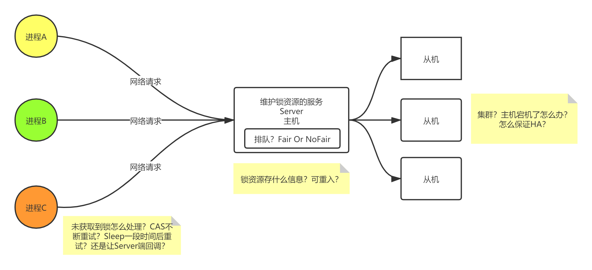
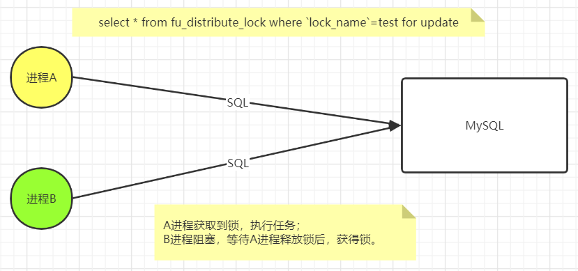
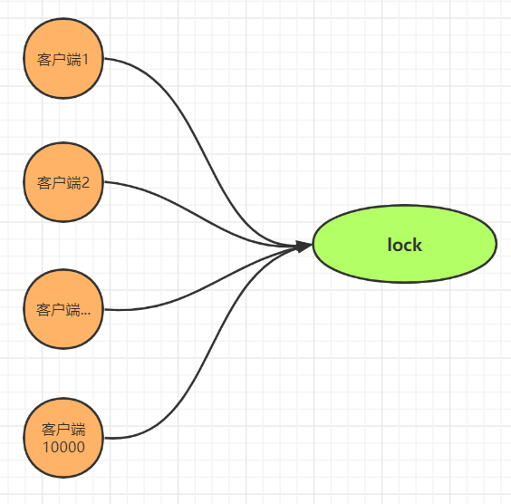

# 分布式锁

## 内容提要

本文是为想要或者正在使用Java分布式锁的开发人员而写的，循序渐进的介绍了它的原理和用法。

前置知识：MySQL、Redis、ZooKeeper基础。

代码获取地址：


## 1 锁

> 假设有这样一个场景：
>
> ​	有线程A、B，要对一份数据进行操作。
>
> ​	如：A，B均要对金钱100进行加50元的操作，正确结果应为200元，但操作可能被分解成如下三步。
>
> 1. A，B均读取到金钱100元
> 2. A，B均执行100+50 = 150元
> 3. A，B均将150元写回，操作结束后，结果为150元（错误）
>
> 为解决这个问题，你会怎么做呢？

### 1.1 锁的本质

* 为充分利用硬件资源，提升应用程序性能，常常采用并发编程。但解决一个问题的同时，往往会面临新的问题与挑战。
* 在单进程系统中，当存在多个线程同时读写某段数据时，应采取何种手段，保证多个线程按照正确的步骤执行，防止数据污染。
* 可以建立一个所有线程都能看得到的标记。当某一线程想执行指令（读写数据）时，应先获取标记，才能执行指令。而当后续线程执行指令时，因标记已被先前线程获取，故而阻塞，等待标记释放后的操作将其唤醒。
* 这个标记称之锁，锁的本质即是确保任意一时刻同一段数据只能有一个线程进行读写操作，保证数据正确性。
* 在不同的平台，锁有不同的实现，只要能满足所有线程均对锁可见即可。如Java中的synchronized关键字采用与对象关联的moniter，AQS采用volatile int state，Linux内核则采用互斥量或信号量等内存数据。

### 1.2 锁的作用

* **提升效率**：使用锁来保证一个任务没有必要被执行两次，比如很昂贵的计算。
* **保证正确**：使用锁来保证任务按照正常的步骤执行，防止两个节点同时操作一份数据，造成文件冲突，数据丢失。


## 2 分布式锁

### 2.1 分布式场景下单机锁的局限性

> 对分布式系统并不了解的同学，推荐周志明老师的[《软件架构探索》](https://icyfenix.cn/)

* 分布式与单机情况下最大的不同在于其不仅仅是多线程，更是多进程。
* 多线程由于可以共享内存，因此可以简单地采取内存作为锁存储位置。那么在分布式场景下，只需将锁存在多个节点都可以访问的数据系统中即可。
* 简单来说，是这样的。但由于在分布式环境下，我们必须考虑到网络环境的延时与不可靠，解决其带来的问题。

### 2.2 我们需要怎样的分布式锁？

**基本可用**

* **互斥性**：防止两个节点同时获取到同一把锁。
* **可重入性**：避免死锁。

**锦上添花**

* **公平性**：根据业务需求，是否建立队列进行排队，防止产生线程饥饿。
* **高可用性**：数据系统高可用，避免单点故障。
* **性能**：上锁与释放的执行时间应远远小于获取锁后执行任务的时间。
* **透明性**：业务使用端应尽量透明，无需关注技术细节。
* **异常情况的处理**：如已获取锁的客户端宕机，GC暂停所有线程等。




## 3 主流实现

### 3.1 MySQL

#### 3.1.1 内部的互斥锁

现代数据库都提供了以下三种锁：

* **写锁**（Write Lock，也叫做排他锁 eXclusive Lock，简写为 X-Lock）：只有持有写锁的事务才能对数据进行写入操作，数据加持着写锁时，其他事务不能写入数据，也不能施加读锁。
* **读锁**（Read Lock，也叫做共享锁 Shared Lock，简写为 S-Lock）：多个事务可以对同一个数据添加多个读锁，数据被加上读锁后就不能再被加上写锁，所以其他事务不能对该数据进行写入，但仍然可以读取。对于持有读锁的事务，如果该数据只有一个事务加了读锁，那可以直接将其升级为写锁，然后写入数据。
* **范围锁**（Range Lock）：对于某个范围直接加排他锁，在这个范围内的数据不能被读取，也不能被写入。如下语句是典型的加范围锁的例子：

```sql
select * from fu_distribute_lock where `lock_name`=? for update
```

**在MySQL InnoDB引擎中，我们可以通过如上语句，为匹配到的数据行上一把行级写锁。基于此思想，实现分布式锁。**



|      | sessionA                                                     | sessionB                                                     |
| ---- | ------------------------------------------------------------ | ------------------------------------------------------------ |
| T1   | begin;     select * from fu_distribute_lock where lock_name = ? for update;     // 成功获取锁，执行任务 |                                                              |
| T2   |                                                              | begin;     select * from fu_distribute_lock where lock_name = ? for update;     // 阻塞 |
| T3   | commit or rollback;                                          |                                                              |
| T4   |                                                              | // 成功获取锁，执行任务                                      |
| T5   |                                                              | commit or rollback;                                          |

**优点**

* 实现简单、易于理解，满足互斥性、可重入性。
* 当已获取锁的客户端宕机时，事务会自动回滚，释放锁，不必担心锁一直被占用。

**弊端**

* MySQL涉及到大量IO操作，相较部分新型数据系统，性能略低。

* 每一进程占用一个数据库连接，大量使用资源，降低正常业务的吞吐量。
* 理论上，MySQL会通过索引，选中对应的数据行，加上行锁。但如果MySQL认为全表扫描效率更高（很小的表，或MVCC导致的未走索引），导致实际情况与预期情况不一致。可采用force强制走索引解决。
* MySQL宕机会导致整个系统不可用。可采用一主两从的方式，同时分机房部署，Master和Slave之间采用半同步方式同步数据。当然这种方案在一些情况会退化成异步模式，甚至在非常极端情况下仍然会造成数据不一致的情况，但是出现的概率非常小。如果你的系统要保证100%的数据强一致，可以选择使用“类Paxos算法”实现的强一致MySQL方案，如MySQL 5.7前段时间刚刚GA的[MySQL Group Replication](https://dev.mysql.com/doc/refman/5.7/en/group-replication.html)。但是运维成本和精力都会相应的增加，根据实际情况选型即可。

#### 3.1.2 表主键的唯一性

**流程**

利用主键唯一的特性，当多个insert请求同时提交到MySQL时，MySQL会保证只有一个操作可以成功，那我们就可以认为那个操作成功的节点获取了分布式锁。

当一个节点成功获取锁后，其他insert请求会返回失败，只需使用while()，循环insert即可。

当业务执行完毕后，发送delete请求，删除这条记录，即代表释放了锁。

```sql
insert into id_distribute_lock(lock_name,expire_time,thread_id) values(?,?,?);
delete from id_distribute_lock where lock_name=?;
```

**优点**

* 实现简单、易于理解，满足互斥性。
* 无需考虑索引引入的不确定行为。
* 无需长期占用数据库连接。

**弊端**

* 不满足可重入性。可添加一个字段count表示上锁次数，解决可重入性问题。
* 当已获取锁的客户端宕机时，锁未被释放，会导致其他客户端无法获取锁。可添加expire_time表示过期时间，thread_id表示线程ID，通过名为watchDog的服务，进行锁租期续约。如果客户端宕机，已获取的锁无法被续约，因此当过期后，可被其他客户端拿到这把锁。
* 公平性，建立一张中间表，将等待锁的线程全记录下来，并根据创建时间排序，只有最先创建的允许获取锁。（本质队列）


### 3.2 Redis

上述基于MySQL的分布式锁原理很简单，也不难实现，但有两个非常明显的缺点。

* **单点问题**：身为传统关系型数据库，MySQL虽能部署集群，但所带来的运维成本和精力都会相应的增加。何不采用比关系型数据库拥有更好扩展性的NoSQL数据库。
* **性能问题**：MySQL涉及到大量IO操作，这使得上锁与释放锁的操作未免太重了，尤其与小任务高并发场景显得格格不入。

为了解决MySQL分布式锁的单点问题、性能问题，基于NoSQL的分布式锁就出现了，接下来我就具体和你分析下其中的原理与实现。

#### 3.2.1 RedisLock

**原理**

```java
setnx();	// set if not exists：存在，不执行，返回0；不存在，执行，返回1
```

Redis上述指令的原子性，天然满足了互斥性，可基于此实现分布式锁。

**下面，我们来解决剩余的一系列问题。**

* 客户端获取锁后，发生宕机，锁无法被正确释放

Redis键值对天生支持TTL。使用lua脚本，保证set指令与expire指令的原子性，设置过期时间；Redis Java Client API也有对应的指令支持。并编写watchDog服务进行续约。

* 续约细节与可重入性

为实现续约时的线程判断，必须引入一个字段存放线程标识符，为实现可重入性，必须引入一个字段存放上锁次数，因此可采用hash数据类型。

* Redis高可用容灾

可部署主从模式或Cluster模式，但因Redis集群只保证最终一致性，仍会存在数据不一致问题。


#### 3.2.2 RedLock

为解决数据不一致问题，Redis作者Antirez推荐大家使用RedLock（红锁）

**RedLock步骤**

假设存在5个Redis节点，这些节点之间既没有主从，也没有集群关系。

* 获取当前时间T1
* 向多个节点申请锁，存在申请成功、申请失败两种返回状态
* 再次获取当前时间T2，计算出申请锁所用时间T3=T2-T1
* 判断是否成功申请RedLock：①从大多数节点中申请到了锁；②锁可用时间>T3
* 成功：实际可用时间=锁可用时间-T3，执行任务
* 失败：释放所有已申请的锁

读者可自行带入实际场景，看看是否解决了Redis Lock的问题。

**本质**

通过多数派的唯一性解决数据不一致问题。


### 3.3 ZooKeeper

上述解决方案看似解决了绝大多数问题，Redis基于内存的操作也拥有极高的性能，但仍有两个问题。

#### 3.3.1 激烈的竞争

当获取不到锁时，客户端可阻塞一段时间（时间长短可根据竞争状态设置），再次请求锁服务数据系统。但此方案会产生很多无效网络请求，同时当大多数请求压到数据系统上，会影响正常业务的吞吐量。

基于ZooKeeper的Watch机制，当锁服务数据节点改变时，才主动回调客户端，进行锁资源的争抢。


**羊群效应**：若所有客户端监听同一节点，当此节点删除时，回调所有客户端进行锁节点的创建。



若存在10000个客户端，每次回调都存在大量的服务资源、网络带宽开销。

**可采用临时顺序节点，解决羊群效应。**

每一客户端只监听它前一个节点，当前一节点释放锁时（删除节点），回调后一节点。


**是否有点眼熟？**	

技术千变万化，终有若干理念贯穿其中。


#### 3.3.2 GC与令牌

下图展示了由于GC问题而导致的数据破坏的例子。该bug并非只是理论存在，HBase曾遭遇过该问题。


因为GC，持有租约的客户端被暂停太久直到租约到期。然后另一个客户端已经获得了锁租约，并开始写数据。接下来，当暂停的线程的客户端重新回来时，它仍然（错误地）认为合法持有锁并尝试写数据，结果导致数据污染。

为解决此问题，我们假设每次锁服务在授予锁或租约时，还会同时返回一个令牌，当令牌（数字）每授予一次就会递增（例如，由锁服务增加）。然后，要求客户端每次向存储系统发送写请求时，都必须包含所持有的fencing令牌。


上图，客户端1获得锁租约的同时得到了令牌号33，但随后陷入了一个长时间的暂停直到租约到期。这时客户端2已经获得了锁租约和令牌号34，然后发送写请求（以及令牌号34）到存储服务。接下来客户端1恢复过来，并以令牌号33来尝试写入，存储服务器由于记录了更高令牌号（34），因此拒绝令牌号33的写请求。

**当使用ZooKeeper作为锁服务时，可以用事务标识zxid或节点版本cversion来充当令牌，这两个都可以满足单调递增的要求。**


## 4 总结

总而言之，分布式锁即是将锁资源放在各客户端均可看到的第三方数据系统，并解决分布式环境所带来的一系列问题。

作为开发者，我们应根据实际业务场景做决策权衡，有利有弊才需要决策，有取有舍才需要权衡。

如果开发者本身的知识面不足以覆盖所需要决策的内容，不清楚其中的利弊，也就不可避免地会陷入选择困难症的困境之中，这便是我们在学习技术时应注重原理的原因。


> 由于水平有限，如果文中有任何问题和不足，烦请您留言告知，不胜感激！


